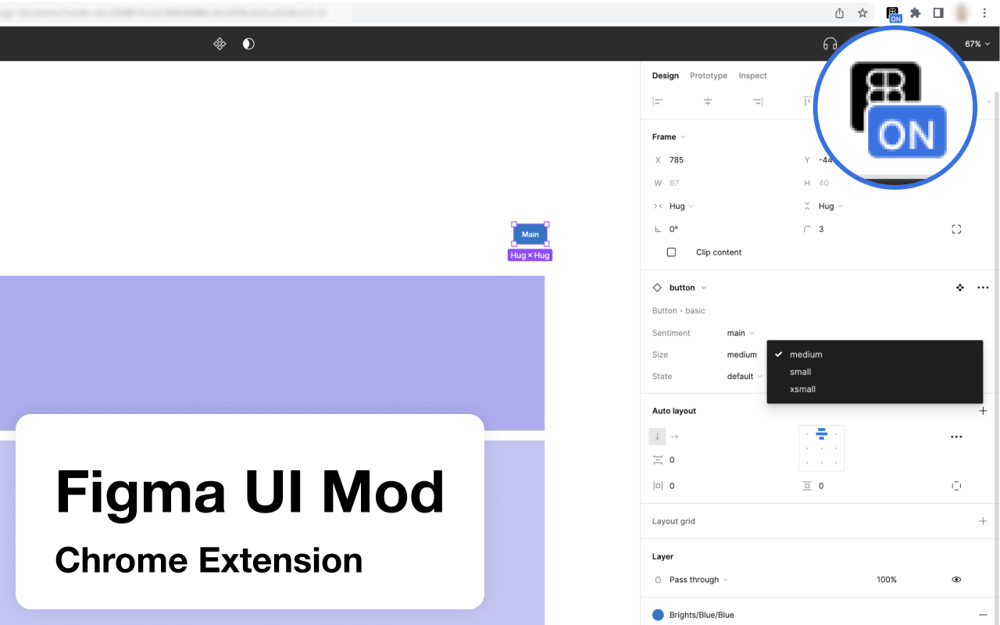
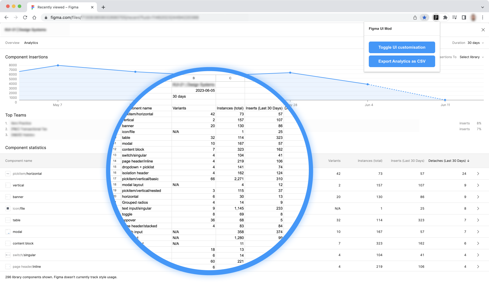
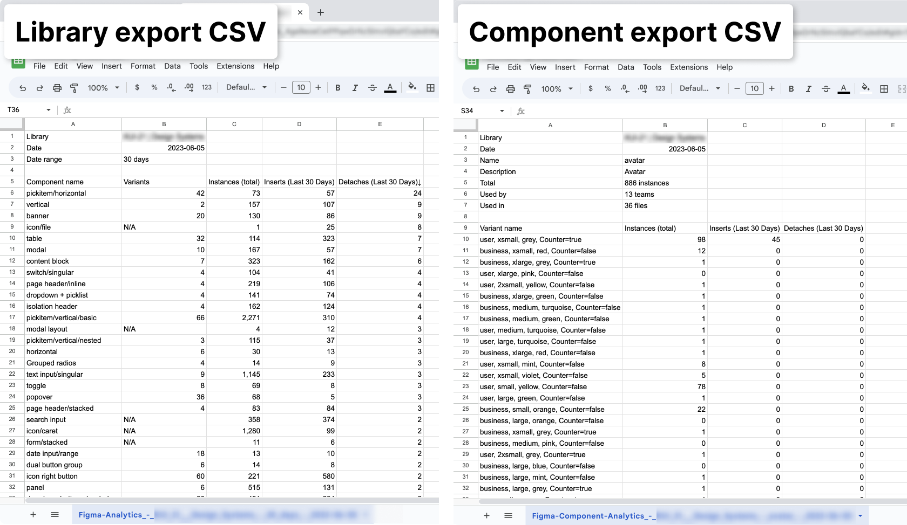

# Advanced Figma options

A chrome extension to provide advanced options for Figma users, including:

**Export Analytics as CSV**
* Export detailed library or component analytics as CSV (Analytics modal needs to be visible on screen)

**Enable several CSS overrides**

Adjust the Figma UI to make better of available space on larger viewports:
* Doubled the width of the Properties Panel (Right hand sidebar) – reduce truncation
* Wider Select Dropdowns – reduce truncation
* Increased the size of File Preview thumbnail – more space due to the wider sidebar
* Added horizontal scroll to the Layer List – avoid truncation of layer names
* Increased the size of Library Analytics modal – instead of a narrow modal it now takes up the full viewport
* Swap instance picker enlarged – reduce truncation

**Images**

## Notes
* The plugin will only function on Figma URLs that match this format `*://*.figma.com/*`
* If you are using multiple tabs at the same time, you might need to toggle the button to relaunch the extension.

## Local setup instructions
1. Download folder to your local machine
2. Open Chrome
3. Open the Extension Management page by navigating to chrome://extensions.
   - The Extension Management page can also be opened by clicking on the Chrome menu, hovering over More Tools then selecting Extensions.
4. Enable Developer Mode by clicking the toggle switch next to Developer mode.
5. Click the LOAD UNPACKED button and select the extension directory.

## Roadmap
- [x] Widen properties panel
- [x] Widen select dropdowns
- [x] Correct some of the quirks in the sidebar
- [x] Allow text overflow for layer name, and horizontal scroll
- [x] Reposition eyedropper
- [x] File preview image enlarged
- [x] Fullscreen analytics and library modal
- [x] Add Library Analytics export

## Known limitations
* Color Styles (Grid view) - Color options set with positioned absolute in 6-column rows.
